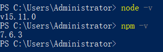
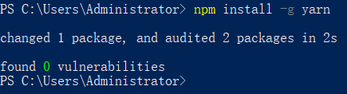
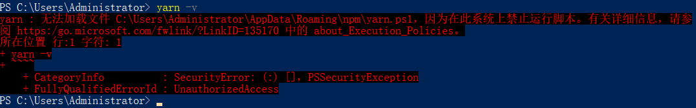
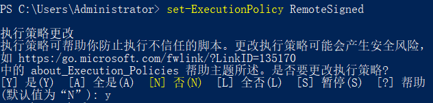
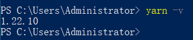
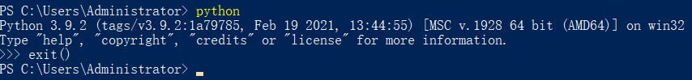
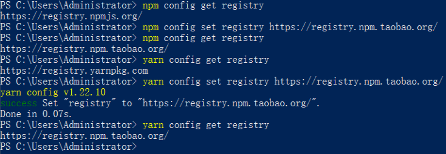

## Development preparation
::: tip Development environment check
因为开发需要基于一定的工具和环境，所以开发之前需要安装相关软件，安装相关环境
:::
| 开发工具 / 环境 |         作用         |         检查方法 |
| --------------- | :------------------: | ---------------: |
| VScode          |     代码编写工具     | 查看是否安装软件 |
| NodeJS          |       运行平台       |          node -v |
| npm / yarn      |      包管理工具      | npm -v / yarn -v |
| python          | 便于本地启动http服务 |        python    |

### Download and Install VScode
[vscode download link](https://code.visualstudio.com/Download)
### Configure VScode
::: warning 对vscode进行配置
安装好`vscode`之后需要对`vscode`做一些基本的配置，以便更好的进行开发
:::

+ 插件安装

| 插件名称             |           作用           |
| -------------------- | :----------------------: |
| Chinese (Simplified) |        汉化vscode        |
| Vetur                | vscode 开发 vue 必备工具 |
| VSCode Great Icons   |      美化文件的图标      |
| Auto Close Tag       |       自动闭合标签       |
| Auto Rename Tag      |      自动重命名标签      |
| koroFileHeader       |     文件自动添加注释     |
| ESLint               |         代码检查         |

`koroFileHeader`在`setting.json`中添加如下字段，可以配置注释信息和生效范围
```json
  "fileheader.customMade": {
    "Author": "XXX",
    "Date": "Do not edit", // 文件创建时间(不变)
    "LastEditors": "XXX", // 文件最后编辑者
    "LastEditTime": "Do not edit", // 文件最后编辑时间
    "FilePath": "Do not edit"
  },
  "fileheader.configObj": {
    "prohibitAutoAdd": [
      "json",
      "md"
    ],
  },
```

### Install NodeJS
[win7 download link](https://nodejs.org/dist/v13.14.0/)  
[win8.1+ download link](https://nodejs.org/dist/latest/)
::: danger NodeJS 的版本选择
在下载最新的 NodeJS 软件，会提示支持 win8.1 及更高版本或者 win server 的相关提示。  
经过测试，v14.0.0 开始，NodeJS 便不再对 win7 进行支持。  
所以如果使用 win7 开发，则最高的开发版本选择是 v13.14.0。  
:::
检查系统是否安装好node `node -v`。（新安装需要重启使path生效）  
NodeJS安装完成之后会自动安装npm  
检查npm是否安装好 `npm -v`。 

### Configure `npm / yarn`
安装好 `NodeJS` ，并且 `npm` 可以使用之后，使用 `node -v` 和 `npm -v` 检查是否能打印出版本号，可以打印出来说明安装成功。   
  
npm可以使用之后，可以使用 `npm install -g yarn` 全局安装 `yarn`  
  
安装完成之后，使用yarn -v出现报错如下，则需要允许计算机执行脚本  
  
输入`set-ExecutionPolicy RemoteSigned`，然后输入 y，关闭窗口即可
  
如果需要关闭计算机执行脚本，执行`set-ExecutionPolicy Restricted`即可  
如果安装好之后，`yarn -v`不生效，可以使用 `set PATH=%PATH%;C:\.yarn\bin"` 配置 `yarn` 的环境变量，再执行`yarn -v`  
  
### Install python
[python download link](https://www.python.org/downloads/)  
选择对应的版本下载安装，然后重启电脑  
  

### Install vue-cli
+ 全局安装vue脚手架服务
`npm install -g @vue/cli`  
查看安装效果 `vue --version` 
+ 切换镜像源 
因为在国内访问的时候，限于网络环境，所以我们使用镜像源会加快下载服务  
  - 查看npm镜像地址：`npm config get registry`  
  - 设置npm镜像地址：`npm config set registry https://registry.npm.taobao.org/`  
  - 查看yarn镜像地址：`yarn config get registry`  
  - 设置yarn镜像地址：`yarn config set registry https://registry.npm.taobao.org/`  
  
::: tip 环境安装完成
至此基本的环境已经安装完成，可以进行开发工作了  
:::